# Hydroecological Riparian Zone

This repository contains flowcharts, ArcGIS Pro workflows, and scripts for delineating hydroecological riparian zone. 

---
## Flowcharts

### 1. **High Level Workflow**
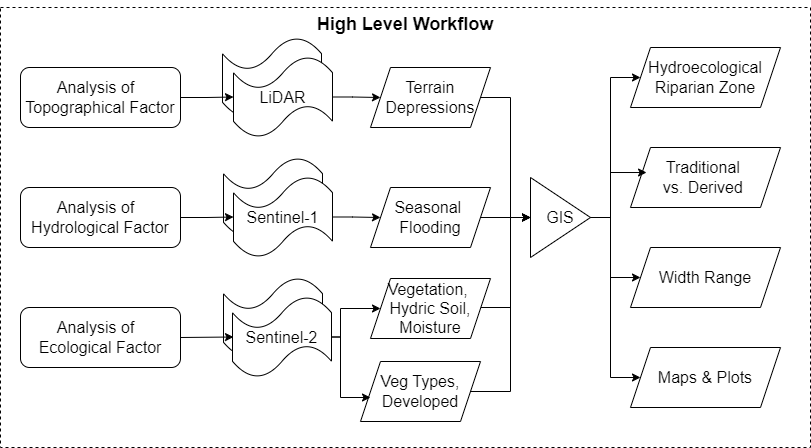
### 2. **Terrain Depressions using LiDAR**
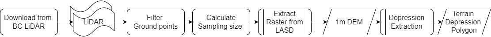
### 3. **Seasonal Flooding using Sentinel-1 Imagery**
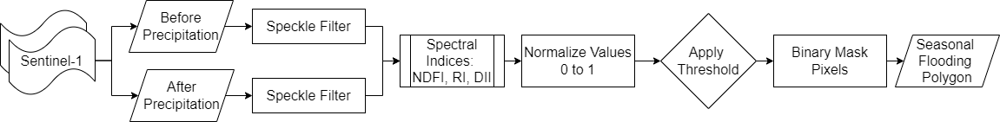
### 4. **Ecological Factors using Sentinel-2 Imagery**
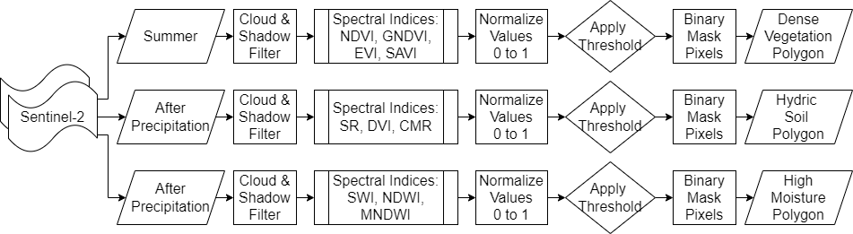
### 5. **Developed Areas using Classification of Sentinel-2 Imagery**
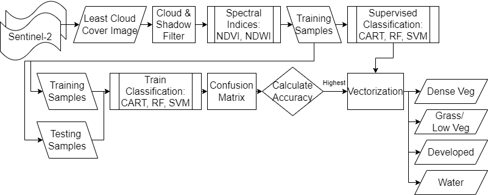
### 6. **Integration of analyzed factors to delineate hydroecological riparian zone**
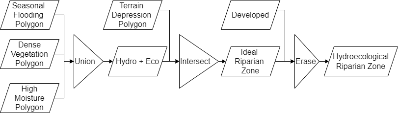

---
## Workflows

### 1. **Extract DEM using LiDAR data**
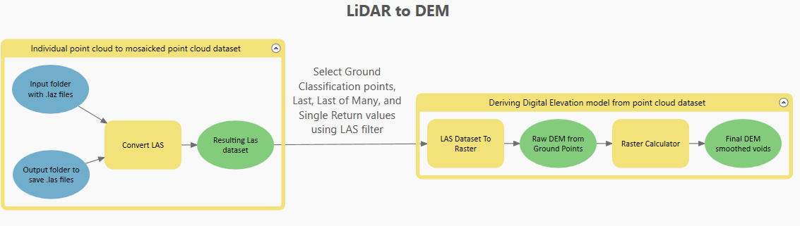
### 2. **Derive hydrological network using DEM**
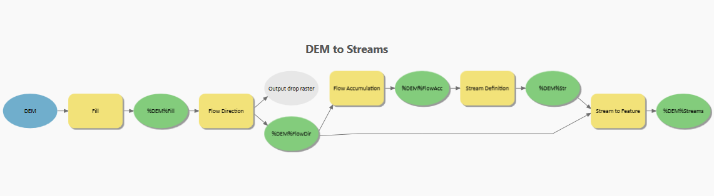
### 3. **Derive terrain depressions using DEM**
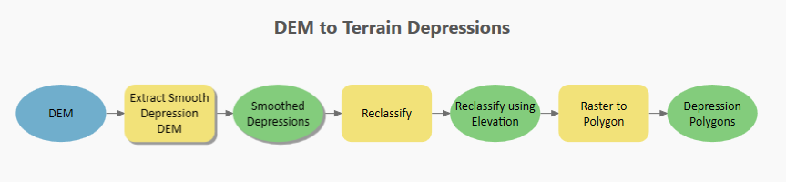
### 4. **Automated batch conversion of Geojson features exported from GEE**
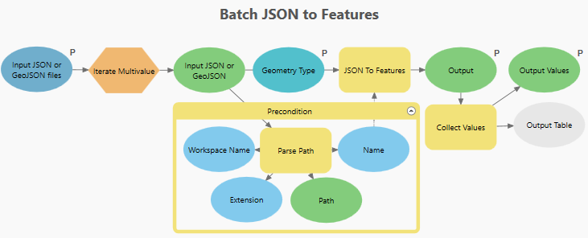
### 5. **Automated integration of analyzed factors**
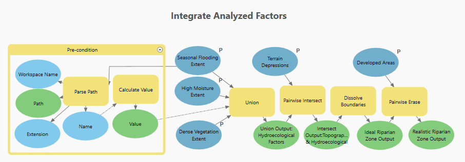
### 6. **Delineate hydroecological riparian zone and calculate width**
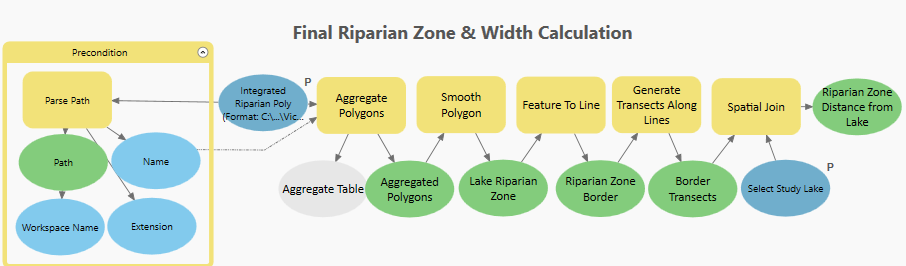

---
## Scripts
Scripts for extracting hydrological and ecological factors influencing riparian zones, utilizing Sentinel Imagery through Google Earth Engine (GEE).

### 1. [Flood.js](Scripts/flood.js)
This script identifies seasonal flooding extents using Sentinel-1 satellite imagery and references established methodologies.

#### **References**
1. **Hamidi, E., Peter, B., Muñoz, D. F., Hamed Moftakhari, & Hamid Moradkhani. (2022)**  
   _Replication Data for: Fast flood extent monitoring with SAR change detection using Google Earth Engine._  
   [Harvard Dataverse](https://doi.org/10.7910/dvn/wotc7e)

2. **UN-SPIDER Knowledge Portal. (2020)**  
   _Recommended Practice: Flood Mapping and Damage Assessment Using Sentinel-1 SAR Data in Google Earth Engine._  
   [UN-SPIDER](https://www.un-spider.org/advisory-support/recommended-practices/recommended-practice-google-earth-engine-flood-mapping)

#### **Script Functionality**
1. Utilizes **Sentinel-1 GRD Synthetic Aperture Radar (SAR)** data to identify **seasonally flooded** areas.
2. Calculates indices, including:  
   - Ratio Index (**RI**)  
   - Normalized Difference Flood Index (**NDFI**)  
   - Difference Image Index (**DII**)
3. Converts flood masks into polygons and calculates the area of flooded pixels.
4. Visualizes the flood extent on a map and exports flood polygons to **Google Drive**.

---

### 2. [Veg.js](Scripts/veg.js)
This script identifies dense vegetation extents using Sentinel-2 satellite imagery and vegetation spectral indices.

#### **Script Functionality**

1. Utilizes **Sentinel-2 multispectral** satellite imagery to detect **dense vegetation** extent.
2. Calculates four spectral indices:
    - Normalized Difference Vegetation Index (**NDVI**)
    - Green Normalized Difference Vegetation Index (**GNDVI**)
    - Enhanced Vegetation Index (**EVI**)
    - Soil-Adjusted Vegetation Index (**SAVI**)
3. Normalizes the indices and thresholds to identify dense vegetation pixels.
4. Identifies connected components of more than 5 pixels to reduce noise.
5. Calculates the area of dense vegetation pixels detected by each index.
6. Visualizes results on the map and exports the dense vegetation polygons as GeoJSON files to Google Drive.
7. Refers examples from the Google Earth Engine Help Documentation.

---

### 3. [Soil.js](Scripts/soil.js)
This script identifies hydric soils extents using Sentinel-2 satellite imagery and soil spectral indices.

#### **Script Functionality**

1. Utilizes **Sentinel-2 multispectral** satellite imagery to detect **hydric soils** extent.
2. Calculates three spectral indices:
    - Simple Ratio (**SR**)
    - Difference Vegetation Index (**DVI**)
    - Clay Mineral Ratio (**CMR**)
3. Normalizes the indices and thresholds to identify hydric soils pixels.
4. Creates masks to exclude pixels in perennial waterbodies.
5. Calculates the area of hydric soils pixels detected by each index.
6. Visualizes results on the map and exports the hydric soils polygons as GeoJSON files to Google Drive.
7. Refers examples from the Google Earth Engine Help Documentation.

---

### 4. [Moisture.js](Scripts/water.js)
This script identifies high moisture extents using Sentinel-2 satellite imagery and moisture spectral indices.

#### **Script Functionality**

1. Utilizes **Sentinel-2 multispectral** satellite imagery to detect **high moisture** extent.
2. Calculates three spectral indices:
    - Soil Wetness Index (**SWI**)
    - Normalized Difference Moisture Index (**NDMI**)
    - Modified Normalized Difference Water Index (**MNDWI**)
3. Normalizes the indices and thresholds to identify high moisture pixels.
4. Creates masks to exclude pixels in perennial waterbodies.
5. Calculates the area of high moisture pixels detected by each index.
6. Visualizes results on the map and exports the high moisture polygons as GeoJSON files to Google Drive.
7. Refers examples from the Google Earth Engine Help Documentation.

---

### 5. [Classify.js](Scripts/classify.js)
This script identifies developed areas to be excluded from final riparian zone using Sentinel-2 satellite imagery and Supervised Classification Algorithms (CART, RF, SVM).

#### **Script Functionality**

1. Utilizes **Sentinel-2 multispectral** satellite imagery to extract **developed areas**.
2. Uses Supervised Classification Algorithms (CART, RF, SVM) to classify the image
3. Calculates NDVI and NDWI indices & appends to image to be used for classification
4. Calculates accuracy metrics for each classifier and selects the best classifier
5. Vectorizes the classified image into polygons for each class
6. Visualizes results on the map and exports the classified polygons as GeoJSON files to Google Drive.
7. Refers examples from the Google Earth Engine Help Documentation.

---

### How to Use
Copy scripts into GEE to run on Code Editor
